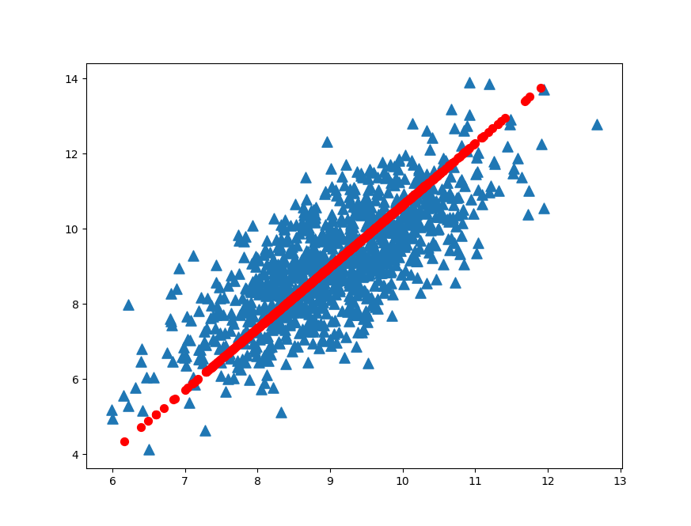

# PCA

## 1. 主成分分析

优点：降低数据的复杂性，识别最重要的多个特征。

缺点：不一定需要，且可能损失有用信息。

使用数据类型：数值型数据


## 2. 在NumPy中实现PCA

将数据转换成前K个主成分的伪码：

去除平均值（让样本矩阵中心化，即每一个维度减去该维度的均值，使每一维度上的均值为0）

计算协方差矩阵

计算协方差矩阵的特征值和特征向量

将特征值从大到小排序

保留最上面的K个特征向量

将数据转换到上述K个特征向量构建的新空间中


补充阅读：协方差矩阵

（1）一个维度上方差的定义：
$$
var(X)=\frac{\sum_{i=1}^{n}(X_{i}-{\bar{X}})(X_{i}-{\bar{X}})}{n-1}
$$
（2）协方差的定义：
$$
cov(X,Y)=\frac{\sum_{i=1}^{n}(X_{i}-{\bar{X}})(Y_{i}-{\bar{Y}})}{n-1}
$$
方差是协方差的一个特例，X与其自身的协方差就是X的方差。

分母为n-1是因为随机变量的数学期望未知，以样本均值代替，自由度减一。

协方差就是定义了两个维度之间的相关性，即这个样本的两个维度之间有没有关系。

协方差为0，证明这两个维度之间没有关系；协方差为正，两个维度正相关；协方差为负，两个维度负相关。

（3）协方差矩阵：

对n个维度，任意两个维度都计算一个协方差，组成矩阵。
$$
C_{n \times n}=( c_{i,j}, c_{i,j}=cov(Dim_{i},Dim_{j}))
$$
直观地，对于一个含有x，y，z三个维度的样本，协方差矩阵如下：
$$
C=\begin{pmatrix}
cov(x,x) & cov(x,y) & cov(x,z)\\ 
cov(y,x) & cov(y,y) & cov(y,z)\\ 
cov(z,x) & cov(z,y) & cov(z,z)
\end{pmatrix}
$$
可以看出，对角线表示了样本在各个维度上的方差，其他元素表示不同维度两两之间的相关性。


例：

假设原始数据为5个样本，每个样本有2个特征x和y。矩阵是：
$$
Data =
\begin{bmatrix}
1 & -1\\ 
1 & 1\\ 
2 & 1\\ 
2 & 2\\ 
4 & 2
\end{bmatrix}
$$
第一步，样本矩阵中心化（计算每个维度的均值，所有样本都减去均值）

维度x的均值为2，维度y的均值为1。

各维度去均值后，矩阵是：
$$
DataAdjust = 
\begin{bmatrix}
-1 & -2\\ 
-1 & 0\\ 
0 & 0\\ 
0 & 1\\ 
2 & 1
\end{bmatrix}
$$


这时，两个维度上的均值都为0。

第二步，计算协方差矩阵

协方差矩阵：
$$
\begin{align*}
C &=
\begin{bmatrix}
cov(x,x) & cov(x,y)\\ 
cov(y,x) & cov(y,y)
\end{bmatrix}\\
&=
\begin{bmatrix}
\frac{(-1) \times (-1) + (-1) \times (-1) + 0 \times 0 + 0 \times 0 + 2 \times 2}{4} & 
\frac{(-1) \times (-2) + (-1) \times (0) + 0 \times 0 + 0 \times 1 + 2 \times 1}{4}\\ 
\frac{(-2) \times (-1) + (0) \times (-1) + 0 \times 0 + 1 \times 0 + 1 \times 2}{4}  & 
\frac{(-2) \times (-2) + (0) \times (0) + 0 \times 0 + 1 \times 1 + 1 \times 1}{4}
\end{bmatrix}\\
&=
\begin{bmatrix}
1.5 & 1.0\\ 
1.0 & 1.5
\end{bmatrix}
\end{align*}
$$
第三步，计算协方差矩阵的特征值和特征向量
$$
eigenValues=\begin{pmatrix}
2.5 & 0.5
\end{pmatrix}
$$

$$
eigenVectors=\begin{pmatrix}
0.70710678 & -0.70710678\\
0.70710678 & 0.70710678
\end{pmatrix}
$$

特征值2.5对应的特征向量是eigenVectors的第1列：
$$
\begin{pmatrix}
0.70710678\\
0.70710678
\end{pmatrix}
$$
特征值0.5对应的特征向量是eigenVectors的第2列：
$$
\begin{pmatrix}
-0.70710678\\
0.70710678
\end{pmatrix}
$$
第四步，将特征值按照从大到小的顺序排列，选择其中最大的k个，然后将其对应的k个特征向量分别作为列向量组成特征向量矩阵

这里特征值只有2个，我们选取最大的那个2.5，对应的特征向量是：
$$
\begin{pmatrix}0.70710678\\0.70710678\end{pmatrix}
$$
第五步，将样本点投影到选取的特征向量上。

假设样本数为m，特征数为n，减去均值后的样本矩阵为DataAdjust(m×n)，协方差矩阵为C(n×n)，选取的k个特征向量组成的矩阵为TopEigenVectors(n×k)，那么投影后的低维数据LowDimData为：
$$
LowDimData_{m\times k}=DataAdjust_{m \times n} \times TopEigenVectors_{n \times k}
$$
这里是
$$
LowDimData=
\begin{bmatrix}
-1 & -2\\ 
-1 & 0\\ 
0 & 0\\ 
0 & 1\\ 
2 & 1
\end{bmatrix}
 \times 
\begin{pmatrix}
0.70710678\\
0.70710678
\end{pmatrix}
=
\begin{bmatrix}
-2.12132034\\ 
-0.70710678\\ 
0\\ 
0.70710678\\ 
2.12132034
\end{bmatrix}
$$
这样就将原始样本的n维（这个例子n=2）特征变成了k维（这个例子k=1），这k维就是原始特征在k维上的投影。

第六步，查看重构之后的数据，用于调试（假设K取值为n，重构回去的数据reconMat应该与原始数据Data重合）
$$
reconMat = (LowDimData * TopEigenVectors.T) + meanVals
$$


程序清单 PCA算法

```python
from numpy import *
import matplotlib
import matplotlib.pyplot as plt

def loadDataSet(fileName, delim='\t'):
    fr = open(fileName)
    stringArr = [line.strip().split(delim) for line in fr.readlines()]
    datArr = [list(map(float,line)) for line in stringArr]
    # python3 needs list()
    return mat(datArr)

def pca(dataMat, topNfeat=9999999):
    meanVals = mean(dataMat, axis=0)
    dataAdjust = dataMat - meanVals #remove mean
    covMat = cov(dataAdjust, rowvar=0)
    eigVals,eigVects = linalg.eig(mat(covMat))
    eigValInd = argsort(eigVals)            #sort, sort goes smallest to largest
    eigValInd = eigValInd[:-(topNfeat+1):-1]  #cut off unwanted dimensions
    topEigVects = eigVects[:,eigValInd]       #reorganize eig vects largest to smallest
    lowDimDataMat = dataAdjust * topEigVects#transform data into new dimensions
    reconMat = (lowDimDataMat * topEigVects.T) + meanVals
    return lowDimDataMat, reconMat

dataMat = loadDataSet('testSet.txt')
lowDimDataMat, reconMat = pca(dataMat, 1)

fig = plt.figure()
ax = fig.add_subplot(111)
ax.scatter(dataMat[:,0].flatten().A[0],  dataMat[:,1].flatten().A[0], marker='^', s=90)
ax.scatter(reconMat[:,0].flatten().A[0], reconMat[:,1].flatten().A[0], marker='o', s=50, c='red')
plt.show()
```

运行结果如图1：



<center>图1 原始数据集(三角形)及第一主成分(圆形)</center>

